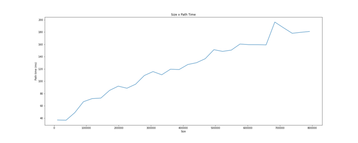
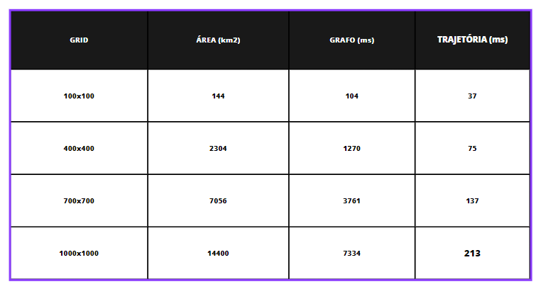

# Introdução

O processo de realização de voos em baixa altitude de modo a aumentar a cobertura oferece variados tipos de riscos, os quais englobam: colisão com o solo (CFIT); exposição ao inimigo; áreas propensas a interceptação de radares, além de regiões densamente povoadas. Para Dorsett e Wyskida (1985), "a capacidade dos modernos sistemas de defesa aérea forçou as aeronaves militares a utilizar voos de baixa altitude para evitar a detecção e aumentar a capacidade de sobrevivência". Conforme o avanço tecnológico, novas táticas e estratégias são cada vez mais demandadas por parte da aviação militar. Desse modo, "a forma da trajetória deve conseguir garantir um voo seguro em condições mínimas de tempo e consumo de energia considerando as limitações de colisão do terreno" (KOSARI et al., 2018).

A construção de uma trajetória de voo de referência é a etapa mais importante e, "à medida que as missões requerem voos em baixa altitude, sobrevoar principalmente em terrenos acidentados é consideravelmente mais desafiador e requer conhecimento prévio de elevação do terreno" (CAMPOS et al., 2016). Esses aspectos aumentam a necessidade da implementação de ferramentas de controle que assegurem a segurança e eficiência para esse tipo de voo, englobando o planejamento de condução da aeronave em devidas localidades a serem percorridas e o seu potencial de voo.

Tendo em vista essa necessidade, enquanto houver a implementação de tecnologias auxiliares que contornam trajetos que evadam restrições, o levantamento próximo ao solo coleta detalhes que não são visíveis ao sobrevoar em altitudes mais elevadas (MELITA et al., 2020). No entanto, a sua ausência reforça as ameaças presentes em voos de baixa altitude, de modo que represente resultados abaixo do desejado e não aproveite feições geográficas vantajosas para a otimização do percurso. A seleção de uma rota de voo baixo que uma aeronave adere pode ser usada a favor da penetração na cobertura de defesa aérea, enquanto, ao mesmo tempo minimiza a exposição e abate (DORSETT; WYSKIDA, 1985). Visto que essa seleção, com o auxílio de uma ferramenta específica de controle de voo, possibilita uma missão finalizada com segurança.

Os bancos de dados orientados a grafos se configuram como uma solução promissora para lidar com os desafios de planejamento e controle de voos em baixa altitude. Tais bancos de dados possuem grande potencial para lidar com informações espaciais, como a elevação do terreno e outras características geográficas que são relevantes para o planejamento de rotas de voo. A utilização desses bancos de dados é capaz de representar, de maneira eficiente e intuitiva, dados geoespaciais complexos, permitindo que informações críticas sejam integradas e utilizadas para apoiar a tomada de decisões no processo de planejamento de rotas de voo (MELITA et al. 2020).

Além disso, os bancos de dados orientados a grafos podem ser utilizados para modelar as redes de defesa aérea, permitindo que informações sobre as áreas que são propensas a interceptação de radares e outros riscos sejam integradas ao processo de planejamento de rotas. A utilização de bancos de dados orientados a grafos é capaz de permitir o fácil acesso e integração das informações relativas à rede de defesa aérea com as informações geoespaciais pertinentes ao planejamento de rotas de voo (KOSARI et al. 2018).

De acordo com Campos et al. (2016), a utilização de tecnologias de banco de dados capazes de lidar com informações geoespaciais é fundamental para assegurar um voo seguro e eficiente em condições mínimas de tempo e consumo de energia, considerando as limitações de colisão do terreno e outros riscos associados aos voos de baixa altitude. Destarte, a utilização de bancos de dados orientados a grafos pode contribuir de maneira significativa para o planejamento e controle de voos em baixa altitude, permitindo que as informações espaciais e de rede sejam integradas de forma eficiente e utilizadas para apoiar a tomada de decisões no processo de planejamento de rotas.

Para a resolução do problema de planejamento de trajetórias em voos de baixa altitude, o artigo científico utiliza o banco de dados Neo4J com Java, com o objetivo de construir uma aplicação que recebe dois pares de coordenadas e cria uma área com pontos igualmente distribuídos em uma resolução x, priorizando menores altitudes nos trajetos e menores distâncias.

A escolha por um banco de dados orientado a grafos é uma solução promissora para lidar com informações espaciais, como a elevação do terreno e outras características geográficas relevantes. Esses bancos de dados são capazes de representar, de maneira eficiente e intuitiva, dados geoespaciais complexos, permitindo que informações críticas sejam integradas e utilizadas para apoiar a tomada de decisões no processo de planejamento de rotas de voo.

MELITA et al. (2020) afirmam que a utilização de bancos de dados orientados a grafos tem se mostrado eficiente para lidar com informações espaciais, permitindo que informações críticas sejam integradas e utilizadas para apoiar a tomada de decisões no processo de planejamento de rotas de voo. KOSARI et al. (2018) também apontam que bancos de dados orientados a grafos são úteis na modelagem de informações geoespaciais, uma vez que permitem a representação de informações geográficas complexas de maneira intuitiva.

De mesmo modo, Campos et al. (2016) destacam que o Neo4J é uma opção promissora para a modelagem de informações geográficas, pois é capaz de lidar com dados geográficos de grande volume e complexidade, tornando-se uma ferramenta viável para o planejamento de rotas de voo. Dessa forma, a escolha do banco de dados Neo4J para a resolução do problema de planejamento de trajetórias em voos de baixa altitude parece ser uma opção adequada e eficiente, em consonância com as recomendações apresentadas na literatura científica.

# Descrição do problema

Desta forma, a otimização da trajetória da aeronave refere-se à solução de parâmetros como velocidade e altitude durante o todo o processo sob indicadores de desempenho, como menor tempo e o menor consumo de combustível em todo o processo (YANG, Y., 2022). Sendo um dos fatores desse processo, o sobrevoo em altitudes baixas é uma medida que contribui para a redução da complexidade do problema de otimização, envolvendo maior precisão na identificação e engajamento de alvos no solo, aumento da visibilidade para as tropas no solo e redução da exposição a ameaças aéreas. Em algumas situações, voar a altitudes mais baixas pode ajudar a reduzir a assinatura radar da aeronave, tornando-a mais difícil de detectar. Nesse sentido, segundo Kim, C. et al. (2015) “A capacidade de voo para obter um terreno seguindo o voo próximo ao solo é necessária para reduzir a probabilidade de que uma aeronave de caça possa ser detectada pela cerca de radar do inimigo”. Essas restrições constituem um envelope seguro o qual a trajetória pode ser definida. Ademais, Yang (2022) salienta que o planejamento da trajetória reduz a probabilidade da aeronave ser ameaçada por manobras e oportuniza durante a missão analisar dados em tempo real. 

No entanto, “as demandas performáticas do voo de baixa altitude são devidas à relação espaço-temporal perigosa e à rápida mudança do piloto e do ambiente, ou seja, a ecologia dinâmica. Este ambiente oferece vantagens, bem como perigos” (FLACH, J. M.; WARREN, R., 1995). Apesar do voo em altitude baixa proporcionar diversas vantagens, apresenta riscos, estes são colisões com obstáculos que podem estar ocultos ou incompreensíveis, tal como a colisão com o solo, aumentando a frequência desse tipo de colisão.
Na aviação, CFIT é a “colisão em voo ou quase colisão com o terreno, água ou obstáculo sem indicação de perda de controle”. (IATA, 2017, pp. 3). De acordo com Jarvis J. A. III et al. (2004) “Apenas na aviação comercial, mais de 30 por cento de todos os acidentes fatais em todo o mundo são classificados como acidentes de voo controlado para o terreno (CFIT)”, corroborando a necessidade de se obter um meio de modo que diminua o número de acidentes aeronáuticos.

Os acidentes, sejam devidos a obstáculos ou devido a aproximação com o solo, são de extrema gravidade, sendo que em sua maioria resultam fatalidades. “Os acidentes CFIT de voo controlado contra o terreno continuam a ser a principal causa de mortes e perdas de fuselagem na aviação” (MOROZE, M. L.; SNOW, M. P., 1999), tornando-se imprescindível conduzir uma pesquisa minuciosa levando em consideração os fatores anteriormente apresentados, tendo como intuito minimizar acidentes na área da aviação por meio da elaboração de medidas que fornecem segurança durante o voo, visto que, “o acidente do tipo CFIT acontece por uma sucessão de erros e violações do piloto” (FERNANDES, A., F. & COSTA N., G., 2020). Isso acontece porque, segundo Kirkendoll & Hook (2021), “durante o vôo controlado para o terreno (CFIT), a aeronave tem a capacidade aerodinâmica de evitar o terreno, mas fatores como a perda do piloto de consciência situacional ou distração levam à colisão com o terreno”.

Para mitigar esse risco, as aeronaves utilizam o sistema de terrain following, que usa sensores a bordo para detectar e evitar obstáculos no terreno. O terrain following permite que a aeronave siga automaticamente o terreno abaixo dela, mantendo uma distância segura e evitando colisões. Para tanto, é abordado o procedimento de geração de trajetória otimizada, visto que “Para a maioria dos cenários de voo de espaçonaves atmosféricas ou exoatmosféricas, uma trajetória bem projetada geralmente é a chave para um voo estável e para melhor orientação e controle do veículo” (RUNQI C. et al, 2019). Desse modo, o trabalho tem como intuito garantir uma trajetória de voo precisa, evitando acidentes CFIT e reduzindo erros que podem atrapalhar a conclusão da missão no ar ao mesmo tempo que proporciona eficiência e segurança a partir da retificação do sistema de terrain following e do sistema desenvolvido neste trabalho, o qual faz proveito de tecnologias já existentes como integração com a ferramenta GIS, que disponibiliza a visualização topológica do terreno onde será formado a melhor rota considerando as respectivas zonas de exclusão que significam e alertam riscos ou contraindicações de seguimento.

Essa é uma abordagem que favorece em como lidar com incertezas relacionadas ao percurso em baixa altitude, obtendo maior controle e certificando de quais medidas preventivas devem ser tomadas em casos específicos de como evitar o CFIT, levando-se também em consideração o adentramento forçado em zonas de exclusão como opção de extrema necessidade. 
O uso do sistema de otimização de rota contribui para a identificação de rotas seguras para a aeronave, de modo que evite áreas montanhosas e outros obstáculos, além de auxiliar ao manter a altitude ideal, tendo como definição de altitude consideravelmente baixa o padrão de 500 pés do chão. Esse proporcionamento por indicar os melhores trajetos que podem ser percorridos, também reduz o tempo de viagem durante a missão, tornando-a menos exaustiva para o piloto e, como consequência, evita a ocorrência de colisões com o terreno e oferece maiores chances de sobrevivência, um problema que tem risco de ocorrer devido a quem controla a aeronave. 
As consequências positivas são possíveis por meio de recursos tecnológicos auxiliares desenvolvidos com uso de dados da região alvo e, conforme a existência de fatores que podem contribuir para o CFIT, tais como terrenos muito elevados, a presença de barreiras e outros fatores que apresentam perigo como as áreas de detecções é, por conseguinte, calculada a rota contendo desvios dos fatores mencionados, facilitando para o piloto o controle da aeronave durante todo o processo até o destino do voo, além de aprimorar a segurança aérea e melhorar a eficiência da operação.

A fim de atingir tal finalidade para a realização do desenvolvimento de algoritmo planejador de trajetórias, foram projetados grafos e testes de complexidade de tempo e relação com a proporcionalidade de distância e quantidade de pontos necessários em uma malha para formar o ponto de início e de destino da operação.
Esse processo baseia-se em um método hipotético-dedutivo fundamentado na observação do aproveitamento de feições geográficas e de dados topográficos de regiões como São Paulo e Rio de Janeiro, com a extração das suas respectivas coordenadas e no cálculo da rota advinda de informações pré-estabelecidas e inseridas em um banco de dados. O processo presente consiste em etapas, sendo a primeira a escolha do algoritmo em que se comparou o modelo Dikstra e A* e, a partir da análise e teste de ambos, foi levado em consideração qual evita o maior processamento desnecessário. 
Já a segunda etapa, consiste na implementação do algoritmo escolhido de acordo com a malha utilizando-se classes como Vertex e Edge, comuns em estruturas de dados que representam grafos, o qual a exploração de cada vértice é efetuado e instância-se a classe nó, seguida da terceira etapa, em que procede-se a armazenação do custo de saída de um vértice inicial até o vértice destinado, estimando o custo da trajetória e obtendo o processamento de resposta em milissegundos, resultado provido através de testes de execução. Este sistema permite a descoberta das características do terreno e a visualização da rota com nós criados a partir da biblioteca D3.js, sob o uso de API da região topográfica ligada ao algoritmo.

# Trabalhos relacionados

A partir dos principais pontos referentes ao problema expostos na seção "Descrição do Problema" - a saber, as consequências decorrentes de uma missão de voo baixo, como colisão com o solo ou exposição a aeronaves oponentes, que comprometem não apenas a missão, mas também a integridade da aeronave e a segurança de seus ocupantes - esta seção do artigo tem por objetivo apresentar soluções que abordam problemáticas semelhantes àquela introduzida no contexto do texto, além de retomar os principais problemas que motivaram a criação da solução proposta no artigo.

Ao focarmos no cerne da questão - ou seja, o voo em baixa altitude levando em consideração a segurança - podemos citar o artigo "Planejamento de voo de acompanhamento de terreno de baixa altitude para multirotores" como uma referência, uma vez que ele trata de um veículo aéreo capaz de intervir em uma região ampla (desconhecida) e/ou em um cenário modificado por um evento catastrófico (como terremoto, deslizamento de terra, erupção vulcânica, etc.), em que a coleta de dados do solo não é simples nem segura (MELITA et al., 2020). Esse artigo enfatiza a importância da realização desse tipo de missão, mas também destaca os impactos negativos decorrentes dessa ação.

Além disso, para mitigar esses problemas, propõe-se que a trajetória seja gerada levando em consideração a morfologia da área de interesse, representada como um Modelo Digital de Superfície (DSM) georreferenciado, garantindo ao mesmo tempo uma separação segura de quaisquer obstáculos (MELITA et al., 2020). A eficácia da solução é comprovada por meio de testes tanto em simulação quanto em cenários reais (MELITA et al., 2020).

Em suma, a proposta apresentada no artigo supracitado é um exemplo que se relaciona com alguns pontos mencionados neste artigo. Embora a solução proposta não possua muitas semelhanças com a implementada aqui, é importante ressaltar alguns pontos relevantes, como a utilização das feições geográficas para a geração de uma orientação ao piloto.

Outro artigo que aborda o cerne do problema é "Novo planejamento de trajetória de tempo mínimo no terreno seguindo voos", que aprimora as aplicações da dinâmica inversa no processo de planejamento e otimização de trajetória em voos de seguimento de terreno (TFFs) (KOSARI et al., 2018). Seguindo essa linha de raciocínio, a implementação proposta neste artigo converge com a aplicação desse artigo, uma vez que ambos visam à geração de trajetórias otimizadas.

# Descrição da estratégia adotada para resolver o problema

Desse modo, este artigo visa apresentar uma solução que melhor auxilie os pilotos de aeronaves a traçar rotas de forma segura e eficiente onde a navegação em baixa altitude é necessária.

A primeira etapa da estratégia adotada para resolver esse problema consiste na modelagem matemática do problema. Além da identificação dos fatores envolvidos, como a altitude do voo, restrições do espaço geográfico, características da aeronave, quantidade de combustível gasta e outros fatores relevantes para o planejamento da rota, foi necessária a modelagem do gráfico utilizado.

As variáveis ​​de decisão foram definidas como binárias e representam se determinada aresta faz parte da trajetória final ou não. Assim, considerando Xi_j uma aresta que conecta os nós "i" e "j" na direção de "i" para "j", tem-se que Xi_j = {1, caso o caminho seja escolhido ou 0, caso contrário }. Além disso, cada aresta tem um peso definido pela seguinte prescrição "alphaX + betaY", em que X é a distância entre os nós "i" e "j" e Y é a altitude de entre esses. Outro fator considerado na modelagem é a função objetivo. Considerando Ci_j o custo da aresta (i, j), a função objetivo é definida como: Min Somatorio_(i_j) Ci_j x Xi_j. Por fim, as restrições das arestas são as seguintes: considerando A e F o nó inicial e final, respectivamente,

Com base na modelagem matemática, a estratégia adotada envolve a definição do algoritmo a ser utilizada para encontrar a melhor rota entre dois pontos em baixa altitude. Nesse caso, opte por utilizar o algoritmo A*, é uma técnica de busca heurística amplamente utilizada em problemas de otimização de caminhos em gráficos. A grande vantagem do A* em relação a outros algoritmos de busca de caminho mínimo, como o Dijkstra, é que ele utiliza uma função heurística para estimar o custo restante do caminho a ser percorrido, o que permite que o algoritmo possa escolher caminhos mais promissores para explorar primeiro, ansiosa assim a quantidade de nós que precisamos ser examinados, o que é extremamente importante no gráfico do problema exatamente, que é composto por milhares de pontos.

A função heurística utilizada pelo A* é uma estimativa do custo restante de um determinado nó até o objetivo final. Essa função é denominada função heurística admissível e é usada para orientar o algoritmo em direção à solução mais próxima do objetivo. Essa função é uma parte crítica do A* e sua precisão é fundamental para o desempenho do algoritmo. A função heurística adotada neste trabalho é a distância do ponto atual até o ponto final, utilizando a fórmula de Harvesine para calcular a distância no modelo esférico da Terra, acrescida da variação de altitude entre o ponto atual e o ponto final.

OA* funciona da seguinte forma: inicia-se com um nó inicial e um nó objetivo, e uma lista de nós a serem exploradores. A cada iteração, o algoritmo seleciona o nó mais promissor da lista de nós a sermos exploradores e examina todos os seus vizinhos. O custo atual para chegar a esse nó é calculado e o custo total esperado para chegar ao objetivo é estimado com base na função heurística admissível. Se o custo totalmente esperado para chegar ao objetivo através desse nó para menor do que o custo atual de um nó vizinho, então o nó selecionado é adicionado à lista de nós a serem exploradores. Esse processo se dá até que o nó objetivo seja alcançado ou que não haja mais nós disponíveis na lista de nós a serem exploradores. Para o problema em questão, os 'nós' representados na explicação referem-se às coordenadas da malha de pontos gerados.

Uma vez definido o algoritmo, a próxima etapa da estratégia adotada envolve o desenvolvimento da aplicação em si. Essa aplicação funciona da seguinte forma: o usuário, que pode ser representado por um piloto ou pela equipe de planejadores de voos, inserir um ponto de início e outro de fim, e o sistema gera uma malha de nós entre esses dois pontos em uma resolução pré -definida. Cada nó dessa malha é conectado com os seus nós vizinhos mais próximos em todas as direções (norte, sul, leste, oeste, nordeste, noroeste, sudoeste, sudeste), e o algoritmo A* é aplicado para encontrar o melhor caminho entre os dois pontos inseridos pelo usuário. Como resultado, o sistema gera uma lista de coordenadas que representam os pontos que compõem a melhor trajetória encontrada pelo algoritmo, rota essa que é exibida na tela em que o usuário interagiu.

O desenvolvimento da aplicação foi realizado utilizando diversas ferramentas, incluindo a linguagem de programação Java e o framework Spring Boot para a criação do backend, que é uma ferramenta de desenvolvimento de aplicações web que oferece agilidade, recursos robustos e escaláveis, arquitetura modular e altamente flexível . Além disso, foi utilizada a biblioteca GDAL para a leitura de dados geoespaciais, permitindo a leitura dos dados de transferência em formato DTED2.

Para lidar com persistência dos dados, este trabalho utiliza um banco de dados orientado a gráficos. Esses tipos de banco de dados se configuram como uma solução promissora para lidar com os desafios de planejamento e controle de voos em baixa altitude. Tais bancos de dados possuem grande potencial para lidar com informações espaciais, como a expedição do terreno e outras características geográficas que são relevantes para o planejamento de rotas de voo. A utilização desses torna possível a representação, de maneira eficiente e intuitiva, de dados geoespaciais complexos. Em específico, foi utilizado o banco de dados Neo4J, que é eficiente para a modelagem de informações geográficas, pois é capaz de lidar com dados geográficos de grande volume e complexidade, tornando-se uma ferramenta viável para o problema em questão.

Para o frontend da aplicação, foram utilizadas a linguagem de marcação HTML, a linguagem de estilização CSS e a linguagem de programação Javascript, bem como a biblioteca D3.js. A utilização do D3.js permitiu a criação de visualizações de dados geográficos dinâmicos e interativos, permitindo a visualização da malha gerada e da rota ótima encontrada.

Para testar as rotas da API, foi utilizada a ferramenta Postman, que permitiu uma fácil integração com o backend da aplicação e realização de testes automatizados. Além disso, uma aplicação foi desenvolvida utilizando a tecnologia Docker, que possibilita a criação de um ambiente isolado para a execução da aplicação, facilitando a gestão de dependências e garantindo maior segurança e estabilidade no ambiente de produção. Com o uso dessas ferramentas, foi possível criar uma aplicação eficiente e de alta qualidade, com uma interface amigável.

## Heurística

Com o intuito de reduzir processamento desnecessário, o algoritmo A* se baseia em uma estratégia de tomada de decisão sempre que um nó está sendo analisado. Nesse sentido, cada vértice respeita a seguinte fórmula

$f(v) = g(v) + h(v)$

Sendo: $g(v)$ o custo de chegar ao vértice atual partindo do início da trajetória, $h(v)$ o custo estimado de chegar ao fim da trajetória partindo do vértice atual, e $f(v)$ o custo total relacionado ao vértice em questão.

O fator $g(v)$ é calculado através da soma dos pesos de cada aresta pertencente ao caminho encontrado que liga o nó de início da trajetória ao vértice atual.

Já $h(v)$ é a heurística em si: usando essa estratégia, o algortimo deixa de analisar vértices que, muito provavelmente, não entrariam no caminho com o menor custo possível. Com isso, os vértices são organizados na fila aberta de acordo com seu custo. Essa heurística deve ser admissível e consistente - nunca estimando um valor superior ao real custo de chagar ao nó de destino.

Na aplicação, a heurística adotada é calculada através da soma entre a distância em linha reta e a variação de altitude relativao do nó em análise ao nó final da trajetória - o mesmo cálculo usado para dar peso às arestas.

## Consistência e admissibilidade da heurística

Para comprovarmos a consistência da heurística e, como Russell e Norvig (2014) dizem, com isso a admissibilidade também se dá, precisamos mostrar que a estimativa de custo final para um nó é sempre menor ou igual ao custo real para alcançar a meta a partir desse nó mais a estimativa heurística para o sucessor desse nó.

Formalmente, isso se dá pela relação abaixo. Uma heurística h(n) é consistente se para todo nó n e seus sucessores n', a seguinte relação é satisfeita:

h(n) <= c(n, n') + h(n')

Em que c(n, n') é o custo real para alcançar o sucessor n' a partir do nó n.

Ou seja, o que essa desigualdade diz é que se h(n) é a estimativa heurística para alcançar a meta a partir do nó n, e h(n') é a estimativa heurística para alcançar a meta a partir do sucessor n', a estimativa heurística para alcançar a meta a partir de n não pode ser maior do que a estimativa heurística para alcançar a meta a partir de n', somada ao custo real para chegar de n a n'.

Em nosso contexto, podemos que concluir que a heurística adotada é consistente e, portanto, admissível pois ela nunca superestima o custo real para alcançar o destino. Isso ocorre porque a distância em linha reta é sempre menor ou igual à distância real, e a variação de altitude é positiva ou zero, nunca negativa. Portanto, a soma desses dois valores não pode ser maior do que o custo real para alcançar o destino. Dessa forma, a  desigualdade h(n) <= c(n, n') + h(n') é sempre satisfeita.

# Análise da complexidade de tempo da solução proposta

Como citado anteriormente, o algoritmo A* é um algoritmo de busca de caminho que encontra o caminho mais curto de um nó inicial a um nó objetivo em um grafo ponderado. O que o diferencia de outros algoritmos é o fato dele usar uma heurística para orientar a busca na direção do objetivo. O funcionamento do algoritmo A* é baseado em uma função de custo f(n) = g(n) + h(n), onde g(n) é o custo acumulado do nó inicial até o nó atual n e h(n) é uma estimativa heurística do custo do nó atual n até o nó objetivo. A função heurística adotada neste trabalho, como citado na seção anterior, é a distância do ponto atual até o ponto final acrescida da variação de altitude entre o ponto atual e o ponto final.

Em geral, a complexidade de tempo do A* é proporcional à quantidade de nós expandidos durante a busca, o que pode ser influenciado pela qualidade da heurística. Uma boa heurística pode levar a uma complexidade de tempo menor, pois o algoritmo precisa explorar menos nós para encontrar uma solução.

No pior caso, quando a heurística não é admissível e não orienta adequadamente a busca na direção do objetivo, o algoritmo pode ter uma complexidade de tempo exponencial, o que significa que o tempo necessário para encontrar uma solução aumenta exponencialmente à medida que o tamanho do espaço de estados aumenta. Para esse caso, a complexidade de tempo pode ser expressa em termos de 
O(b^d), onde b é o fator de ramificação médio do espaço de estados e d é a profundidade da solução encontrada pelo algoritmo.

O fator de ramificação médio (b) é definido como o número médio de sucessores para cada nó no espaço de nós. A profundidade da solução encontrada pelo algoritmo (d) é definida como o número de etapas ou ações necessárias para alcançar a solução a partir do estado inicial. 

No entanto, no melhor caso, o algoritmo A* encontra o caminho mais curto em tempo constante, independente do tamanho do grafo, o que em termos da notação Omega pode ser expresso como: [latex] \Omega (1)[/latex].

Para avaliar o caso médio, fizemos testes empíricos em que consideramos o nó inicial estando na primeira coluna da malha de nós gerada e o nó final estando na última coluna da malha. Utilizando uma heurística admissível, realizamos testes para calcular o menor caminho para diferentes tamanhos de grafos. Podemos visualizar esses testes por meio de um gráfico em que no eixo Y temos o tempo, em millisegundos, para gerar o caminho mínimo e no eixo X temos o número de nós do grafo.

Analisando os resultados, podemos concluir que para o caso médio a complexidade é linear, proporcional ao número de nós. Ou seja, se dobrarmos o número de nós, o tempo para calcular o melhor caminho deve dobrar também. É visto que em muitos casos, o A* pode encontrar uma solução rapidamente, com uma complexidade de tempo muito menor do que a exponencial. Isso ocorre porque uma heurística consistente pode reduzir drasticamente o tamanho do espaço de estados a ser explorado.

# Resultados obtidos

A partir das citações e análises de complexidade e corretude, levando em consideração que o algoritmo A* é o melhor e mais conhecido algoritmo para mapeamento utilizando grafos, pode-se concluir que o algoritmo possui um bom desempenho, porém com algumas ressalvas que serão discutidas a seguir.

Em primeiro lugar, é importante destacar que seu desempenho é inversamente proporcional à quantidade de nós a serem percorridos, o que resulta em um aumento no tempo necessário para escolher o melhor caminho. Essa análise pode ser visualizada, por exemplo, em trajetos que percorrem uma grande quantidade de nós, como um trajeto que tem início em uma das pontas da malha e término na outra ponta que se encontra no lado oposto da diagonal entre essas duas pontas.

Além disso, a heurística é outro ponto importante a ser considerado. Ela é formada pela correlação das variáveis de altitude e distância, bem como do custo entre o nó de origem e o de destino. Dependendo do resultado do custo, pode haver um aumento na complexidade e, consequentemente, no tempo necessário para a conclusão do algoritmo.

Portanto, apesar das observações e explicações simplificadas das análises obtidas, é necessário demonstrar a efetividade do algoritmo na prática em relação à sua atuação.

O conteúdo apresentado anteriormente está de acordo com a linha de raciocínio adotada, pois à medida que a área aumenta, a performance da criação da malha de pontos (grafo) e da trajetória gerada diminui. No entanto, mesmo em grandes quantidades, como 14.400 quilômetros quadrados, o tempo de geração ainda se mantém na casa dos milissegundos, o que se repete na criação do caminho.

Diante dos resultados obtidos nos testes realizados, pode-se concluir que o algoritmo A* é eficiente e eficaz na geração de caminhos otimizados para uso na tecnologia de terrain following.

# Conclusão

Considerando os resultados apresentados na seção anterior e retomando o objetivo principal deste estudo, que é a criação de rotas otimizadas para voos de baixa altitude com o intuito de minimizar os impactos inerentes a essa modalidade de voo, como por exemplo, colisões com o solo ou detecção por inimigos, e ainda, aumentar a segurança e a integridade da aeronave, foi desenvolvido um programa que implementa o algoritmo A* em uma interface gráfica de usuário por meio de uma aplicação web, direcionada tanto para planejadores de missões quanto para pilotos.

Além disso, em relação à aplicação desenvolvida, o software permite que o usuário insira dados de coordenadas nas regiões do estado do Rio de Janeiro e de São Paulo, gerando trajetórias baseadas em restrições de altitude e critérios de distância.

Na perspectiva do usuário, os passos percorridos são restritos à visualização gráfica, enquanto na camada do planejador de trajetórias, o algoritmo A* atua com alta performance, mesmo em áreas extensas, conforme apresentado na seção anterior.

Além de atender ao objetivo proposto neste artigo, o software desenvolvido é categorizado como de código aberto, o que permite a abertura para desenvolvedores interessados no projeto, que tenham o objetivo de otimizar ou até mesmo usufruir de suas funcionalidades, como a mudança da escolha de variáveis que fazem parte da heurística, conscientes da potencialidade do programa.

# Referências Bibliográficas

CAMPOS, S. G. et al. A Height Estimation Approach for Terrain Following Flights from Monocular Vision, 2016. Disponível em: https://www.ncbi.nlm.nih.gov/pmc/articles/PMC5191052/. Acesso em: 18 fev. 2023.

DORSETT, M. J.; WYSKIDA, R.M. A minimum-exposure, minimum-elevation military aircraft heuristic route selection model, 1985. Disponível em: https://www.sciencedirect.com/science/article/pii/0307904X85901258. Acesso em: 17 fev. 2023.

FLACH, J., M.; WARREN, R. Chapter Low-altitude Flight. Local Applications of the Ecological Approach To Human-Machine Systems, 1995. Disponível em: https://www.taylorfrancis.com/chapters/edit/10.1201/9780203748749-3/low-altitude-flight-john-flach-rik-warren. Acesso em: 15 marc. 2023.

FERNANDES A., F.; COSTA, N., G. CFIT: meteorologia adversa e fatores humanos, 2020. Disponível em: https://repositorio.pucgoias.edu.br/jspui/handle/123456789/226 Acesso em: 17 marc. 2023.

IATA. IATA Annual Reviews, 2017. Disponível em: https://www.iata.org/contentassets/c81222d96c9a4e0bb4ff6ced0126f0bb/iata-annual-review-2017.pdf Acesso em: 20 marc. 2023.

JARVIS, J., A. III et al. Flight Simulator Evaluation of Synthetic Vision Display Concepts to Prevent Controlled Flight Into Terrain (CFIT), 2004. Disponível em: https://ntrs.nasa.gov/citations/20040058105. Acesso em: 15 marc. 2023.

KASSAEI, S. I.; KOSARI, A. Aircraft Trajectory Planning with an Altitude-Bound in terrain-following flight (in Persian). Modares Mechanical Engineering. 17. 135-144, 2018. Disponível em: https://www.researchgate.net/publication/321462018_Aircraft_Trajectory_Planning_with_an_Altitude-Bound_in_terrain-following_flight_in_Persian. Acesso em: 16 fev. 2023.

KIM, C. et al. Development of Low Altitude Terrain Following System based on TERain PROfile Matching. Journal of Institute of Control, Robotics and Systems. Institute of Control, Robotics and Systems, 2015. Disponível em: https://scienceon.kisti.re.kr/srch/selectPORSrchArticle.do?cn=JAKO201510251883617.  Acesso em: 18 marc. 2023.

KIRKENDOLL, Z.; HOOK, LR. Automatic Ground Collision Avoidance System Trajectory Prediction and Control for General Aviation, 2021. Disponível em: https://ieeexplore.ieee.org/abstract/document/9594506/figures#figures.  Acesso em: 17 marc. 2023.

MELITA, C. D. et al. Low-Altitude Terrain-Following Flight Planning for Multirotors, 2020. Disponível em: https://www.researchgate.net/publication/342453243_Low-Altitude_Terrain-Following_Flight_Planning_for_Multirotors. Acesso em: 18 fev. 2023.

MOROZE, M., L.; SNOW, M., P. Causes and Remedies of Controlled Flight into Terrain in Military and Civil Aviation, 1999. Disponível em: https://apps.dtic.mil/sti/citations/ADA430280.  Acesso em: 23 marc. 2023.

RUNQI, C. et al. A review of optimization techniques in spacecraft flight trajectory design, Progress in Aerospace Sciences, Volume 109, 2019. Disponível em: https://www.sciencedirect.com/science/article/abs/pii/S037604211830191X. Acesso em: 23 marc. 2023.

YANG, Y. Optimization of Aircraft Flight Trajectory Combined with Thinking Navigation Algorithm, 2022. Disponível: https://www.hindawi.com/journals/am/2022/6169331/. Acesso em: 22 marc. 2023.

RUSSELL, S. J.; NORVIG, P. Artificial Intelligence: A Modern Approach. 3rd ed. Upper Saddle River, NJ: Pearson, 2014. Acesso em 05 abr. 2023.
