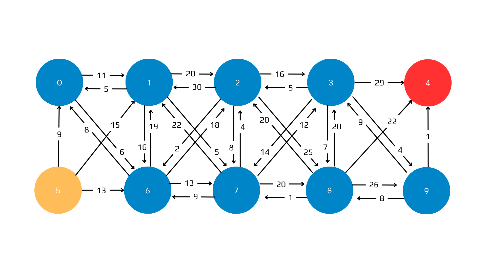
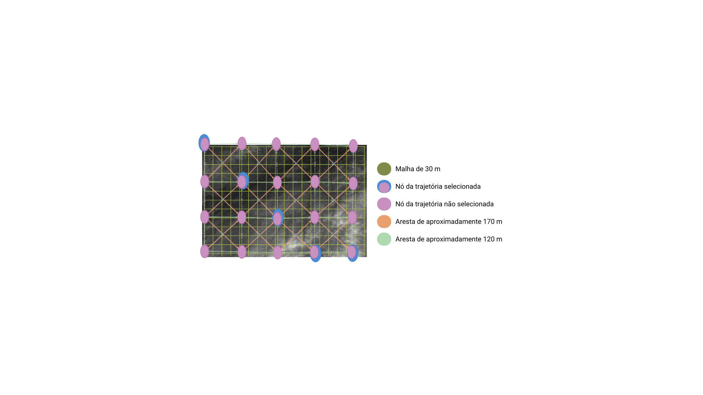
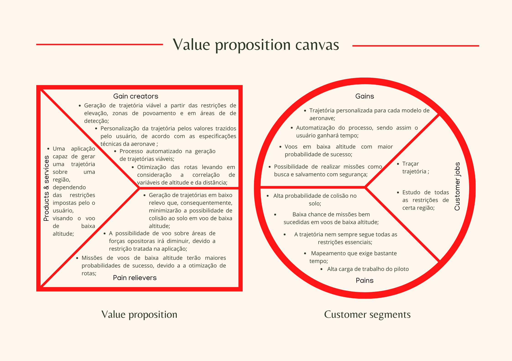
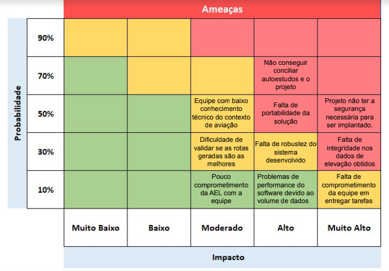
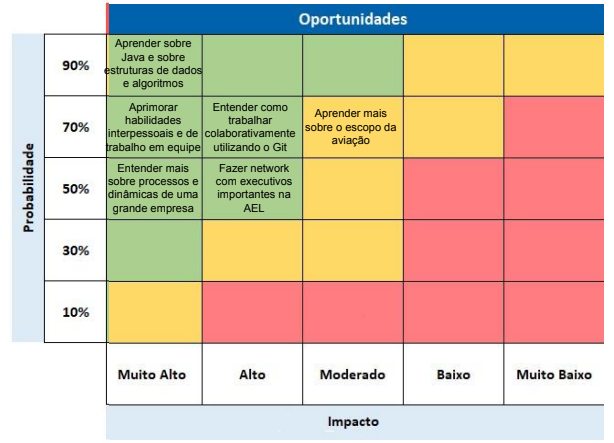

<table>
<tr>
<td>
<a href= "https://ael.com.br/"></a>
</td>
<td><a href= "https://www.inteli.edu.br/"></a>
</td>
</tr>
</table>

<font size="+12"><center>
Planejador de trajetórias para voos em baixa altitude
</center></font>

>*Observação 1: A estrutura inicial deste documento é só um exemplo. O seu grupo deverá alterar esta estrutura de acordo com o que está sendo solicitado nos artefatos.*

>*Observação 2: O índice abaixo não precisa ser editado se você utilizar o Visual Studio Code com a extensão **Markdown All in One**. Essa extensão atualiza o índice automaticamente quando o arquivo é salvo.*

**Conteúdo**

- [Autores](#autores)
- [Visão Geral do Projeto](#visão-geral-do-projeto)
  - [Empresa](#empresa)
  - [O Problema](#o-problema)
  - [Objetivos](#objetivos)
    - [Objetivos gerais](#objetivos-gerais)
    - [Objetivos específicos](#objetivos-específicos)
  - [Partes interessadas](#partes-interessadas)
- [Análise do Problema](#análise-do-problema)
  - [Dados disponíveis](#dados-disponíveis)
  - [Objetivo do problema](#objetivo-do-problema)
  - [Modelagem Matemática do Problema](#modelagem-matemática-do-problema)
    - [Variáveis de Decisão](#variáveis-de-decisão)
    - [Função Objetivo](#função-objetivo)
    - [Restrições](#restrições)
  - [Descrição da solução](#descrição-da-solução)
      - [Qual a solução proposta:](#qual-a-solução-proposta)
      - [Como a solução proposta deverá ser utilizada:](#como-a-solução-proposta-deverá-ser-utilizada)
      - [Quais os benefícios trazidos pela solução proposta:](#quais-os-benefícios-trazidos-pela-solução-proposta)
  - [Variáveis de decisão consideradas](#variáveis-de-decisão-consideradas)
  - [Limitações do problema](#limitações-do-problema)
  - [Representação do Grafo](#representação-do-grafo)
  - [Análise do cenário: Matriz SWOT](#análise-do-cenário-matriz-swot)
  - [Análise da indústria: 5 forças de Porter](#análise-da-indústria-5-forças-de-porter)
      - [Modelo de negócio:](#modelo-de-negócio)
      - [Ameaça de novos concorrentes:](#ameaça-de-novos-concorrentes)
      - [Ameaça de produtos substitutos:](#ameaça-de-produtos-substitutos)
      - [Poder de negociação dos clientes:](#poder-de-negociação-dos-clientes)
      - [Poder de negociação dos fornecedores:](#poder-de-negociação-dos-fornecedores)
      - [Rivalidade entre os concorrentes:](#rivalidade-entre-os-concorrentes)
      - [Referências:](#referências)
  - [Proposta de Valor: Value Proposition Canvas](#proposta-de-valor-value-proposition-canvas)
  - [Matriz de Risco](#matriz-de-risco)
- [Requisitos do Sistema](#requisitos-do-sistema)
  - [Personas](#personas)
    - [Persona Piloto](#persona-piloto)
    - [Persona Planejador](#persona-planejador)
  - [Histórias dos usuários (user stories)](#histórias-dos-usuários-user-stories)
- [Arquitetura do Sistema](#arquitetura-do-sistema)
  - [Módulos do Sistema e Visão Geral (Big Picture)](#módulos-do-sistema-e-visão-geral-big-picture)
  - [Descrição dos Subsistemas](#descrição-dos-subsistemas)
    - [Requisitos de software](#requisitos-de-software)
  - [Tecnologias Utilizadas](#tecnologias-utilizadas)
- [UX e UI Design](#ux-e-ui-design)
  - [Wireframe + Storyboard](#wireframe--storyboard)
  - [Design de Interface - Guia de Estilos](#design-de-interface---guia-de-estilos)
- [Projeto de Banco de Dados](#projeto-de-banco-de-dados)
  - [Modelo Conceitual](#modelo-conceitual)
  - [Modelo Lógico](#modelo-lógico)
- [Teste de Software](#teste-de-software)
  - [Testes Unitários](#testes-unitários)
  - [Teste de Usabilidade](#teste-de-usabilidade)
- [Análise de Dados](#análise-de-dados)
- [Manuais](#manuais)
  - [Manual de Implantação](#manual-de-implantação)
  - [Manual do Usuário](#manual-do-usuário)
  - [Manual do Administrador](#manual-do-administrador)
- [Referências](#referências-1)


# Autores

* Allan Casado
* Leandro Custódio
* Mateus Almeida
* Melyssa Rojas
* Moises Cazé
* Pedro Silva
* Yasmin Rocha


# Visão Geral do Projeto

## Empresa

*Localizada em Porto Alegre, a AEL Sistemas é uma empresa gaúcha que desde 1982 atua no desenvolvimento, fabricação e manutenção de sistemas eletrônicos espaciais e de defesa militar. É uma das poucas empresas do Brasil que atuam no setor de defesa e os seus produtos são tecnologias únicas e customizadas. A empresa faz parte do grupo Elbit Systems, líder mundial no mercado aviônico de defesa.*

## O Problema

*Existe uma gama de operações, sejam elas civis ou militares, que engloba voos a baixa altitude. Este tipo de operação, no entanto, é afetado por fatores externos como regiões muito povoadas, regiões conhecidas de busca, além de oferecer grande risco de colisão com o solo (CFIT). O piloto, por sua vez, no decorrer da missão, por ter muitos pontos em paralelo para controlar e observar, possui uma carga de trabalho muitas vezes maior do que o ideal.*

## Objetivos

### Objetivos gerais

*O objetivo do projeto é o desenvolvimento de um sistema capaz de gerar um trajeto otimizado — ponderando principalmente a altitude e a distância do ponto de partida ao ponto de chegada — para voos em baixa altitude utilizando grafos, com o intuito de facilitar a vida do piloto durante o trajeto, assim gerando missões mais eficientes e seguras para a AEL Sistemas.*

### Objetivos específicos

* Determinar o caminho mais otimizado — que contenha a menor altitude e distância do ponto de partida ao ponto de chegada.
* Promover segurança e previsão para o piloto realizando o trajeto.
* Criação de uma tecnologia que permita realizar trajetos para explorar o máximo do relevo a fim de obter maior cobertura da região com segurança.

## Partes interessadas

*Os principais stakeholders do projeto planejador de trajetórias para voos em baixa altitude realizado pelo Inteli - Instituto de Tecnologia e Liderança em parceria com a empresa AEL Sistemas são: Inteli — que deseja proporcionar uma educação de excelência na área de tecnologia através de projetos reais — e seus alunos — interessados em se tornar profissionais competentes na área enquanto causam impacto positivo utilizando a tecnologia, e a empresa AEL Sistemas — interessada em uma tecnologia capaz de gerar missões mais seguras e eficientes.*

# Análise do Problema

*Ao planejar uma rota para um piloto de avião, é importante levar em consideração a altitude, a distância e as zonas de riscos ao longo do caminho. O sobrevoo em altitudes elevadas aumenta a exposição do piloto e corrobora em possíveis detecções por áreas de monitoramento e a demanda de alto nível de foco.  A falta de obtenção de uma análise topográfica em um percurso, além do cálculo do raio de curva, sendo mínimo ou máximo durante a execução do voo, resulta em condições desfavoráveis, as quais dificultam concluir a missão com segurança e eficiência.*

## Dados disponíveis

*Os dados trazidos pelo banco proporcionado pelo cliente, que determina cada ponto do espaço, são: longitude, latitude e altitude.*

## Objetivo do problema

*Objetiva-se certificar uma rota planejada que seja livre de zonas de monitoramento, altitudes elevadas e possibilidades de colisão quando o voo estiver em baixa altitude, tal como distâncias longas por meio da análise topográfica da região e com base na projeção do caminho mais viável e seguro a partir de um grafo.*

## Modelagem Matemática do Problema
*Para representar a modelagem matemática do problema, o grafo abaixo foi criado como exemplo. Nesse cenário, o nó 5 representa o ponto de partida da trajetória, enquanto o vértice 4 representa o ponto final.*

### Variáveis de Decisão
*Considerando Xi-j uma aresta que conecta, no sentido "i" para "j", esses vértices,*
```
Xi-j = {
        1, caso o caminho seja escolhido
        ou
        0, caso contrário
}
```
*Dessa forma, as variáveis de decisão são binárias e representam se a aresta faz parte da trajetória final ou não.*
### Função Objetivo
*Como a solução busca encontrar o caminho que passe pelas arestas de pesos mais baixos, a função objetivo é descrita da seguinte maneira:*
```
Min F = 11X0-1 + 6X0-6 + 5X1-0 + 20X1-2 + 16X1-6 + 5X1-7 + 30X2-1 + 16X2-3 + 2X2-6 + 8X2-7 + 25X2-8 + 5X3-2 + 24X3-4 + 14X3-7 + 7X3-7 + 4X3-9 + 9X5-0 + 15X5-1 + 13X5-6 + 8X6-0 + 19X6-1 + 18X6-2 + 13X6-7 + 22X7-1 + 4X7-2 + 12X7-3 + 9X7-6 + 20X7-8 + 20X8-2 + 20X8-3 + 22X8-4 + 1X8-7 + 26X8-9 + 9X9-3 + 1X9-4 + 8X9-8
```
### Restrições
```
Nó 0: X1-0 + X5-0 + X6-0 = X0-1 + X0-6
Nó 1: X0-1 + X2-1 + X5-1 + X6-1 + X7-2 = X1-0 + X1-2 + X1-6 + X1-7
Nó 2: X1-2 + X3-2 + X6-2 + X7-2 + X8-2 = X2-1 + X2-3 + X2-6 + X2-7 + X2-8
Nó 3: X2-3 + X7-3 + X8-3 + X9-3 = X3-2 + X3-4 + X3-7 + X3-8 + X3-9
Nó 4: X3-4 + X8-4 + X9-4 = 1
Nó 5: 1 = X5-0 + X5-1 + X5-6
Nó 6: X0-6 + X1-6 + X2-6 + X5-6 + X7-6 =  X6-0 + X6-1 + X6-2 + X6-7
Nó 7: X1-7 + X2-7 + X3-7 + X6-7 + X8-7 = X7-1 + X7-2 + X7-3 + X7-6 + X7-8
Nó 8: X2-8 + X3-8 + X7-8 + X9-8 = X8-2 + X8-3 + X8-4 + X8-7 + X8-9
Nó 9: X3-9 + X8-9 = X9-3 + X9-4 + X9-8
```

## Descrição da solução

#### Qual a solução proposta: 

Sistema de mapeamento de terreno e projeção de trajetórias visando voos em baixa altitude tomando em consideração dados de elevação, manobrabilidade da aeronave, evitando possíveis fatores de risco como áreas conhecidas de busca ou manobras acentuadas. A solução fornecerá um caminho otimizado, ponderando principalmente a altitude e a distância do ponto de partida ao ponto de chegada, se favorecendo de feições geográficas e minimizando a possibilidade de detecção.

#### Como a solução proposta deverá ser utilizada:

Na fase de planejamento da operação, com o time de inteligência e outros possíveis participantes, serão inseridos, além dos pontos de início e fim do percurso, valores de entrada como zonas de exclusão e a saída será um mapa com as coordenadas do trajeto.

#### Quais os benefícios trazidos pela solução proposta:

Um auxílio no planejamento da missão por meio da obtenção de uma rota calculada com base nas variáveis que permita ao piloto viajar com segurança em baixa altitude, evitando zonas de risco e reduzindo sua carga de trabalho, dado que se atentará a menos pontos paralelos à operação enquanto realiza a mesma.

## Variáveis de decisão consideradas

* Mapeamento de pontos do espaço que possuem altitude que se adequam aos valores do intervalo estabelecido pela AEL.

* Formar uma ligação de pontos mapeados anteriormente que possuem menor distância do ponto inicial dado pelo usuário até o ponto final.

* Caso durante a rota escolhida entre os nós haja uma curva será necessário diminuir as arestas de modo que demonstre a curva na visualização.

## Limitações do problema

* Limitação 1 - Envelope de voo e a relação com variáveis de altitude e curva da aeronave: Determinado por combinação de fatores, sendo um deles a altitude, está sendo uma dimensão crítica do envelope de voo, também serve como uma medida de segurança. O envelope de voo define as capacidades operacionais de um avião e representações que, além da altitude, demonstra a curva máxima que indica a velocidade máxima permitida, e a curva mínima necessária para manter a estabilidade do voo em uma determinada altitude. Sendo assim, a altitude e a capacidade de curva são variáveis que não assumem quaisquer valores, pois requerem respeito aos cumprimentos quando estabelecidas pelo sistema e, o envelope de voo avalia diferentes fases durante o percurso, tendo limites de operação envolvendo as variáveis para garantir a segurança e eficiência para a missão.

* Limitação 2 - A altitude relacionada a áreas povoadas e segurança pública: Quando um avião voa a uma altitude baixa sobre regiões habitadas, existem inúmeras preocupações com relação à segurança pública, incluindo potenciais interrupções na comunicação, barulho exagerado e riscos de acidentes. Além disso, requer uma atenção constante do piloto, tornando-se mais desafiador por causa de obstáculos como construções. Desse modo, o trajeto de voo deve ser construído de forma que evada regiões com alto índice de povoamento.

## Representação do Grafo



## Análise do cenário: Matriz SWOT

A Análise SWOT é um framework utilizado para ajudar a avaliar a situação atual de uma empresa, identificando seus pontos fortes (Strengths), fraquezas (Weaknesses), oportunidades (Opportunities) e ameaças (Threats). É uma ferramenta de avaliação de ambiente interno e externo da companhia que permite visualizar as forças e fraquezas internas da empresa, bem como as oportunidades e ameaças externas. O objetivo principal é ajudar a identificar oportunidades de melhoria e a desenvolver estratégias para maximizar as vantagens e minimizar as desvantagens. Além disso, como consequência do uso dessa técnica, acaba-se adquirindo um grande conhecimento da empresa e do mercado que ela atua.


#### Referências:

* AEL Sistemas: https://ael.com.br/ael-sistemas.html

* Importâcia da tecnologia e ciência no meio militar:
https://www.gov.br/defesa/pt-br/assuntos/seprod/ciencia-e-tecnologia

* Sobram vagas no setor de tecnologia no Brasil por falta de profissionais qualificados:
https://g1.globo.com/jornal-nacional/noticia/2022/09/29/sobram-vagas-no-setor-de-tecnologia-no-brasil-por-falta-de-profissionais-qualificados.ghtml

## Análise da indústria: 5 forças de Porter

As Cinco Forças de Porter é um modelo estratégico desenvolvido por Michael Porter que ajuda a analisar a competição dentro de um setor da indústria. O modelo identifica cinco forças que podem afetar a lucratividade e a competitividade de uma empresa. Ao avaliar essas cinco forças, as empresas podem entender melhor o ambiente competitivo em que operam e tomar decisões estratégicas mais eficientes.

#### Modelo de negócio:

A AEL Sistemas é uma empresa riograndense com sede em Porto Alegre, dedicada ao desenvolvimento de soluções voltadas para as indústrias de defesa e aeroespacial. Por meio do uso de tecnologia de ponta, a AEL conquistou reconhecimento no mercado militar internacional, o que levou a parcerias com o Governo brasileiro em importantes projetos voltados a assegurar a segurança pública e a soberania nacional. Desde 2001, a organização faz parte do grupo israelense Elbit Systems, um dos mais relevantes mundialmente no segmento de defesa.

#### Ameaça de novos concorrentes:

A indústria de desenvolvimento de tecnologias de defesa e segurança possui uma barreira de entrada relativamente alta, visto que é preciso de uma grande quantidade de capital para financiar a pesquisa e o desenvolvimento dessas soluções. Nesse sentido, vale destacar que muitos dos projetos da AEL são financiados através de parcerias governamentais. Além disso, a credibilidade das organizações é fundamental, já que os segmentos Defesa, Segurança Pública e Aeroespacial exigem soluções desenvolvidas com o objetivo de minimizar riscos.  Assim, novas empresas que vierem a tentar entrar nesse ramo enfrentarão esses obstáculos.

#### Ameaça de produtos substitutos:

Como a AEL tem a tecnologia de ponta como centro do modelo de negócio, o surgimento de produtos substitutos deve ser um ponto de atenção para a empresa, por conta do crescimento extremamente acelerado da pesquisa e do desenvolvimento de novas soluções nesse ramo, com destaque ao segmento de inteligência artificial. Nesse sentido, a organização precisa estar alerta para o entendimento e a incorporação de novas tecnologias em projetos, antes que outra empresa faça isso e tome parte do domínio de mercado da AEL.

#### Poder de negociação dos clientes:

Esse fator é de extrema importância para a empresa, visto que a produção de tecnologias para fins militares e aeroespaciais depende, em grande parte, do financiamento por parte dos clientes. Isso ocorre porque esse mercado tem um ticket médio alto e muitas das soluções só existem graças a parcerias com órgãos governamentais.

#### Poder de negociação dos fornecedores:

No que tange ao poder de barganha dos fornecedores, a AEL encontra-se em uma posição relativamente desconfortável no mercado. Primeiramente, como muitos dos projetos são financiados pelo Governo, a mudança de políticas públicas relacionadas à priorização e à quantidade de verba destinadas a parcerias público-privadas e iniciativas militares pode variar drasticamente. Ademais, o cenário internacional de turbulência no fornecimento de material para a construção de eletrônicos no mundo também é um ponto de estresse para a companhia.

#### Rivalidade entre os concorrentes:

As indústrias de Defesa, Segurança Pública e Aeroespacial são, em suma, mercados do tipo “business-to-business” (empresa e empresa) e “business-to-government” (empresa e governo). Tendo isso em mente, as organizações desses setores não destinam muitos recursos para o marketing de seus produtos e serviços, mas sim para a manutenção das relações já estabelecidas. Nesse contexto, a AEL já possui uma longa história de projetos bem-sucedidos, o que firma sua posição no mercado. Além disso, a companhia ainda possui estreitas relações com possíveis competidores tanto nacionalmente, a exemplo da Embraer, a qual possui parte das ações da AEL, quanto mundialmente, como o renomado grupo Elbit Systems. Portanto, a organização está muito bem situada na indústria.

#### Referências:

* AEL Sistemas: https://ael.com.br/ael-sistemas.html

* Embraer adquire parte da AEL: https://www.defesanet.com.br/defesa/noticia/2696/embraer-formaliza-a-harpia-e-adquire-capital-da-ael-sistemas/ 

* Políticas de incentivo à indústria de defesa:
https://www.gov.br/defesa/pt-br/assuntos/industria-de-defesa/base-industrial-de-defesa

## Proposta de Valor: Value Proposition Canvas

O Value Proposition Canvas é uma ferramenta que ajuda as empresas a entender e criar propostas de valor para seus clientes. Esse framework é composto por dois elementos principais: a seção dos clientes,  que descreve as necessidades, desejos, preocupações e contextos dos clientes-alvo, e a seção do produto, que descreve as soluções oferecidas para atender às necessidades dos clientes, exibindo como, então, a solução gera valor. O objetivo principal do Value Proposition Canvas é ajudar as empresas a compreender melhor os clientes e a criar propostas de valor que sejam mais eficazes.



## Matriz de Risco

A Matriz de Risco é uma ferramenta utilizada para avaliar e gerenciar os riscos em um projeto. A ideia dessa técnica é representar graficamente os riscos mapeados para determinado projeto e classificá-los de acordo com a sua probabilidade de ocorrência e impacto ao desenvolvimento. É uma ferramenta importante para ajudar as empresas a identificar e gerenciar os riscos de forma eficaz, o que é fundamental para o sucesso dos produtos e da realização de projetos de maneira segura e bem-sucedida, trazendo a possibilidade de identificar e priorizar os riscos mais críticos e, por consequência, desenvolver estratégias para minimizar seu impacto..




# Requisitos do Sistema

*Descrição_dos_requisitos*

## Personas

A Persona é uma representação fictícia do cliente-alvo de uma empresa ou produto. Essa representação descreve as características demográficas, comportamentais, sociais desse grupo específico clientes. Ela permite que as empresas tenham uma visão mais clara e detalhada das necessidades, desejos, preocupações e contextos dos clientes-alvo, o que é fundamental para  a criação de produtos, serviços e soluções que sejam mais atraentes e eficazes, especificamente para esse grupo.

### Persona Piloto


### Persona Planejador


## Histórias dos usuários (user stories)

| User Story | Prioridade | Status |
|--- |--- |--- |
| 1. Eu como piloto quero que o sistema evite rotas cruzadas, para garantir a segurança da
viagem e evitar possíveis colisões. | 7 | A fazer |
| 2. Como piloto, quero que o programa mantenha a altitude o mais baixo possível e dê o
melhor trecho a ser percorrido, para minimizar o tempo de viagem. | 1 | A fazer |
| 3. Como piloto, quero que o programa contribua para minimizar o consumo de
combustível, para reduzir custos e ao mesmo tempo proteger o meio ambiente. | 10 | A fazer |
| 4. Como piloto, quero que a trajetória de voo evite sistemas de monitoramento (SAMs) e
áreas conhecidas de patrulha, para garantir a segurança da operação. | 4 | A fazer |
| 5. Como piloto, quero que a trajetória de voo evite regiões muito povoadas, para minimizar
riscos de segurança pública. | 6 | A fazer |
| 6. Como piloto, quero que a trajetória aproveite também feições geográficas elevadas para
evitar restrições, arrastos e condições adversas. | 2 | A fazer |
| 7. Como piloto, quero ter uma interface intuitiva e objetiva, para que possa me concentrar
na missão sem me preocupar com dificuldades técnicas. | 3 | A fazer |
| 8. Como piloto quero um sistema que reduza a carga horária de trabalho para torná-la
menos desgastante e ter maior foco na missão. | 8 | A fazer |
| 9. Como operador, quero definir zonas de exclusão, restrições e outras informações em
parâmetros de entrada para manter um sistema de planejamento eficiente. | 5 | A fazer |
| 10. Como piloto, quero uma ferramenta de roteamento que me dê informações precisas sobre a distância do percurso de forma otimizada para operar em baixa altitude do ponto de início até o ponto de retorno como destino. | 6 | A fazer |
| 11. Como piloto quero capturar dados e informações com facilidade para gerar valor à
missão. | 9 | A fazer |


| User Story | Solução |
|--- |--- |
| 1 | A ferramenta deve evitar rotas cruzadas para garantir a segurança da viagem e evitar possíveis colisões por meio de um sistema de detecção de rota que evite previamente áreas com riscos de cruzamentos.
 |
| 2 | Uma ferramenta de otimização de rota que leva em consideração a altitude mais baixa e propícia que contribui para a diminuição do tempo de viagem.|
| 3 | Com a recomendação do melhor caminho a ser percorrido, com o uso da ferramenta pode haver economia de combustível, principalmente ao evitar altitudes muito altas e com barreiras. |
| 4 | A ferramenta deve incluir dados sobre áreas de monitoramento(SAMs) para evitar o risco de exposição do piloto e que alertam o piloto sobre possíveis áreas de risco. |
| 5 | A ferramenta deve ajudar a evitar regiões muito povoadas para minimizar riscos de segurança pública. Isso pode ser feito por meio de um sistema de análise de dados que use informações de densidade populacional e dados de segurança pública para definir zonas de exclusão. |
| 6 | Uma ferramenta que inclui dados de feições geográficas, bem como outras informações úteis que ajudam a evitar zonas de restrições ao percorrer a trajetória. |
| 7 | A ferramenta deve disponibilizar uma interface simples e objetiva, com recursos intuitivos e objetivos que permitam o piloto ter foco total na missão sem se preocupar excessivamente com dificuldades técnicas.
 |
| 8 | A ferramenta deve incluir recursos para reduzir a carga horária de trabalho do piloto através de um planejamento e informações úteis que facilitam e encurtam os percursos das missões, permitindo que o piloto se concentre em tarefas mais críticas e conclua a missão com sucesso. |
| 9 | A ferramenta deve permitir que os operadores definam zonas de exclusão e outras restrições como parâmetros de entrada através de um sistema de interface de usuário que permita ao operador definir essas entradas. |
| 10 | A ferramenta deve incluir um sistema de roteamento que leve em consideração a distância do percurso otimizado para operar em baixa altitude que pode ser feito através de um sistema de planejamento de voo que use informações de dados sobre a performance da aeronave e roteamento otimizado para determinar a melhor rota. |
| 11 | A ferramenta deve recomendar o melhor trajeto levando em consideração características topográficas e também de tempo para aproveitar ao máximo a exploração do terreno com segurança.
 |


# Arquitetura do Sistema

## Módulos do Sistema e Visão Geral (Big Picture)

## Descrição dos Subsistemas

### Requisitos de software


## Tecnologias Utilizadas


# UX e UI Design

## Wireframe + Storyboard

## Design de Interface - Guia de Estilos


# Projeto de Banco de Dados

## Modelo Conceitual

## Modelo Lógico


# Teste de Software

## Testes Unitários

## Teste de Usabilidade


# Análise de Dados


# Manuais

## Manual de Implantação

## Manual do Usuário

## Manual do Administrador


# Referências
