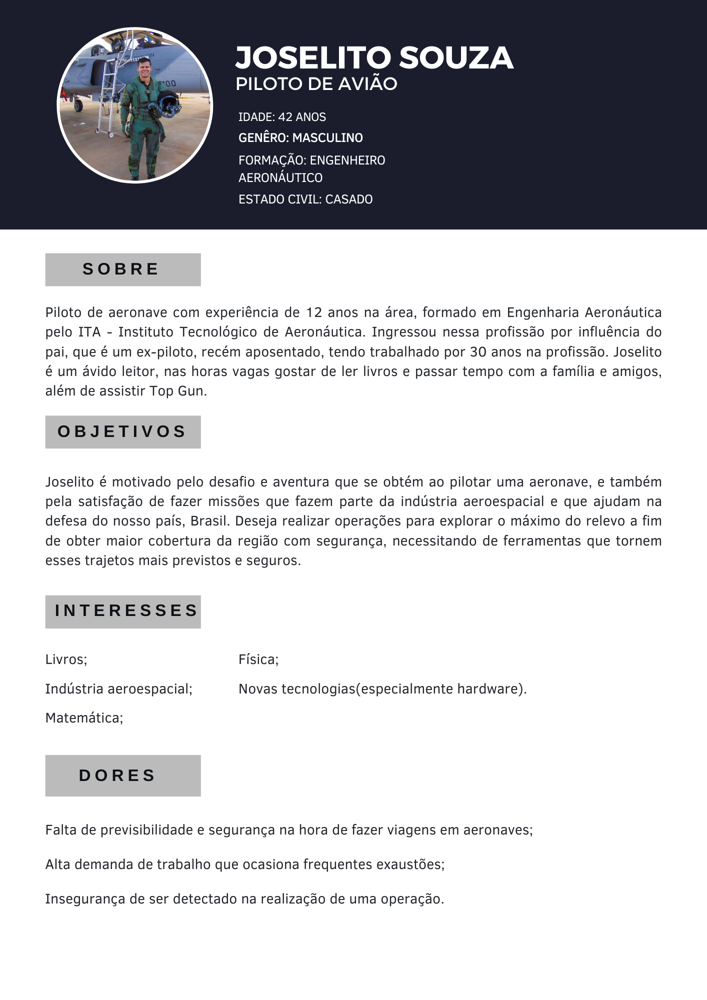

<table>
<tr>
<td>

</td>
<td>
</td>
</tr>
</table>

Planejador de trajetórias para voos em baixa altitude

>*Observação 1: A estrutura inicial deste documento é só um exemplo. O seu grupo deverá alterar esta estrutura de acordo com o que está sendo solicitado nos artefatos.*

>*Observação 2: O índice abaixo não precisa ser editado se você utilizar o Visual Studio Code com a extensão **Markdown All in One**. Essa extensão atualiza o índice automaticamente quando o arquivo é salvo.*

**Conteúdo**

- [Autores](#autores)
- [Visão Geral do Projeto](#visão-geral-do-projeto)
  - [Empresa](#empresa)
  - [O Problema](#o-problema)
  - [Objetivos](#objetivos)
    - [Objetivos gerais](#objetivos-gerais)
    - [Objetivos específicos](#objetivos-específicos)
  - [Partes interessadas](#partes-interessadas)
- [Análise do Problema](#análise-do-problema)
  - [Análise da área de atuação](#análise-da-área-de-atuação)
  - [Análise do cenário: Matriz SWOT](#análise-do-cenário-matriz-swot)
  - [Proposta de Valor: Value Proposition Canvas](#proposta-de-valor-value-proposition-canvas)
  - [Matriz de Risco](#matriz-de-risco)
- [Requisitos do Sistema](#requisitos-do-sistema)
  - [Personas](#personas)
  - [Histórias dos usuários (user stories)](#histórias-dos-usuários-user-stories)
- [Arquitetura do Sistema](#arquitetura-do-sistema)
  - [Módulos do Sistema e Visão Geral (Big Picture)](#módulos-do-sistema-e-visão-geral-big-picture)
  - [Descrição dos Subsistemas](#descrição-dos-subsistemas)
    - [Requisitos de software](#requisitos-de-software)
  - [Tecnologias Utilizadas](#tecnologias-utilizadas)
- [UX e UI Design](#ux-e-ui-design)
  - [Wireframe + Storyboard](#wireframe--storyboard)
  - [Design de Interface - Guia de Estilos](#design-de-interface---guia-de-estilos)
- [Projeto de Banco de Dados](#projeto-de-banco-de-dados)
  - [Modelo Conceitual](#modelo-conceitual)
  - [Modelo Lógico](#modelo-lógico)
- [Teste de Software](#teste-de-software)
  - [Testes Unitários](#testes-unitários)
  - [Teste de Usabilidade](#teste-de-usabilidade)
- [Análise de Dados](#análise-de-dados)
- [Manuais](#manuais)
  - [Manual de Implantação](#manual-de-implantação)
  - [Manual do Usuário](#manual-do-usuário)
  - [Manual do Administrador](#manual-do-administrador)
- [Referências](#referências)

# Autores

* Allan Casado
* Leandro Custódio
* Mateus Almeida
* Melyssa Rojas
* Moises Cazé
* Pedro Silva
* Yasmin Rocha

# Visão Geral do Projeto

## Empresa

*Localizada em Porto Alegre, a AEL Sistemas é uma empresa gaúcha que desde 1982 atua no desenvolvimento, fabricação e manutenção de sistemas eletrônicos espaciais e de defesa militar. É uma das poucas empresas do Brasil que atuam no setor de defesa e os seus produtos são tecnologias únicas e customizadas. A empresa faz parte do grupo Elbit Systems, líder mundial no mercado aviônico de defesa.*

## O Problema

*Existe uma gama de operações, sejam elas civis ou militares, que engloba voos a baixa altitude. Este tipo de operação, no entanto, é afetado por fatores externos como regiões muito povoadas, regiões conhecidas de busca, além de oferecer grande risco de colisão com o solo (CFIT). O piloto, por sua vez, no decorrer da missão, por ter muitos pontos em paralelo para controlar e observar, possui uma carga de trabalho muitas vezes maior do que o ideal.*

## Objetivos

### Objetivos gerais

*O objetivo do projeto é o desenvolvimento de um sistema capaz de gerar um trajeto otimizado — ponderando principalmente a altitude e a distância do ponto de partida ao ponto de chegada — para voos em baixa altitude utilizando grafos, com o intuito de facilitar a vida do piloto durante o trajeto, assim gerando missões mais eficientes e seguras para a AEL Sistemas.*

### Objetivos específicos

* Determinar o caminho mais otimizado — que contenha a menor altitude e distância do ponto de partida ao ponto de chegada.
* Promover segurança e previsão para o piloto realizando o trajeto.
* Criação de uma tecnologia que permita realizar trajetos para explorar o máximo do relevo a fim de obter maior cobertura da região com segurança.

## Partes interessadas

*Os principais stakeholders do projeto planejador de trajetórias para voos em baixa altitude realizado pelo Inteli - Instituto de Tecnologia e Liderança em parceria com a empresa AEL Sistemas são: Inteli — que deseja proporcionar uma educação de excelência na área de tecnologia através de projetos reais — e seus alunos — interessados em se tornar profissionais competentes na área enquanto causam impacto positivo utilizando a tecnologia, e a empresa AEL Sistemas — interessada em uma tecnologia capaz de gerar missões mais seguras e eficientes.*

# Análise do Problema

*Ao planejar uma rota para um piloto de avião, é importante levar em consideração a altitude, a distância e as zonas de riscos ao longo do caminho. O sobrevoo em altitudes elevadas aumenta a exposição do piloto e corrobora em possíveis detecções por áreas de monitoramento e a demanda de alto nível de foco.  A falta de obtenção de uma análise topográfica em um percurso, além do cálculo do raio de curva, sendo mínimo ou máximo durante a execução do voo, resulta em condições desfavoráveis, as quais dificultam concluir a missão com segurança e eficiência.*

## Objetivo do problema

*Objetiva-se certificar uma rota planejada que seja livre de zonas de monitoramento, altitudes elevadas e possibilidades de colisão quando o voo estiver em baixa altitude, tal como distâncias longas por meio da análise topográfica da região e com base na projeção do caminho mais viável e seguro a partir de um grafo.*

## Limitações do problema

* Limitação 1 - Envelope de voo e a relação com variáveis de altitude e curva da aeronave: Determinado por combinação de fatores, sendo um deles a altitude, está sendo uma dimensão crítica do envelope de voo, também serve como uma medida de segurança. O envelope de voo define as capacidades operacionais de um avião e representações que, além da altitude, demonstra a curva máxima que indica a velocidade máxima permitida, e a curva mínima necessária para manter a estabilidade do voo em uma determinada altitude. Sendo assim, a altitude e a capacidade de curva são variáveis que não assumem quaisquer valores, pois requerem respeito aos cumprimentos quando estabelecidas pelo sistema e, o envelope de voo avalia diferentes fases durante o percurso, tendo limites de operação envolvendo as variáveis para garantir a segurança e eficiência para a missão.

* Limitação 2 - A altitude relacionada a áreas povoadas e segurança pública: Quando um avião voa a uma altitude baixa sobre regiões habitadas, existem inúmeras preocupações com relação à segurança pública, incluindo potenciais interrupções na comunicação, barulho exagerado e riscos de acidentes. Além disso, requer uma atenção constante do piloto, tornando-se mais desafiador por causa de obstáculos como construções. Desse modo, o trajeto de voo deve ser construído de forma que evada regiões com alto índice de povoamento.

## Análise da área de atuação

*Descrição_da_análise_da_área_de_atuação*

## Análise do cenário: Matriz SWOT

*Matriz_SWOT*

## Proposta de Valor: Value Proposition Canvas

*Value_Proposition_Canvas*

## Matriz de Risco

*Matriz_de_risco*

# Requisitos do Sistema

*Descrição_dos_requisitos*

## Persona

## Histórias dos usuários (user stories)

*Descrição_das_histórias_dos_usuários*

# Arquitetura do Sistema

## Módulos do Sistema e Visão Geral (Big Picture)

## Descrição dos Subsistemas

### Requisitos de software

## Tecnologias Utilizadas

# UX e UI Design

## Wireframe + Storyboard

## Design de Interface - Guia de Estilos

# Projeto de Banco de Dados

## Modelo Conceitual

## Modelo Lógico

# Teste de Software

## Testes Unitários

## Teste de Usabilidade

# Análise de Dados

# Manuais

## Manual de Implantação

## Manual do Usuário

## Manual do Administrador

# Referências
