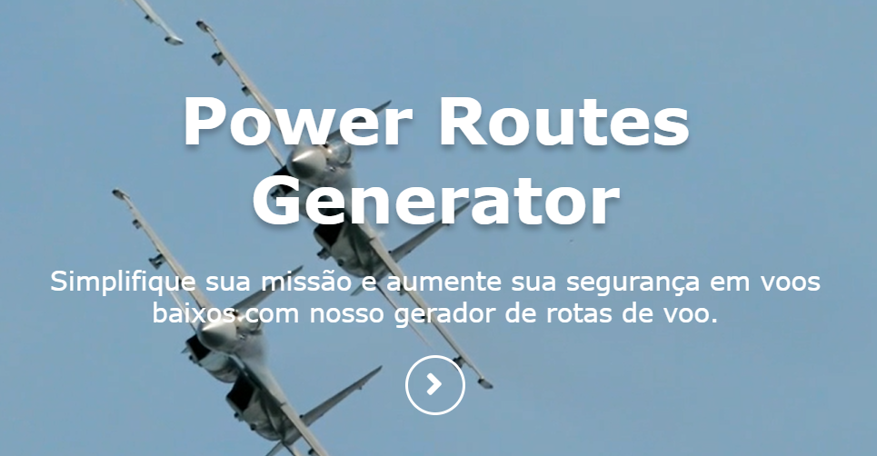
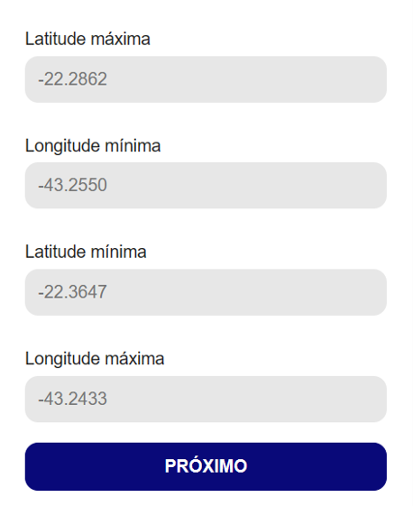
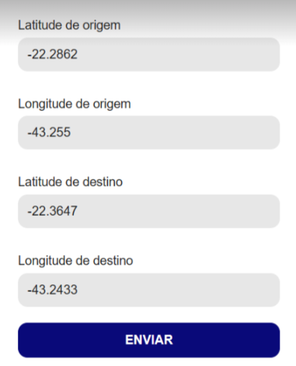

# Manual do Usuário:

Este manual foi criado com o intuito de orientar o usuário no decorrer de sua jornada na aplicação Power Routes Generator.

**Primeiro passo:**

Clique no botão de seta na primeira página:

**Segundo Passo:**

Na segunda página, insira a latitude e a longitude do ínicio da malha de pontos, logo em seguida insira as coordenadas do final da malha. Abaixo estão os campos de preenchimento, e assim que preenchê-los clique em “próximo”:

**Terceiro passo:**

Ainda estando na segunda página, insira as coordenadas do ponto de origem e as coordenadas do ponto de destino nos quatro inputs, logo depois clique em “próximo”:

