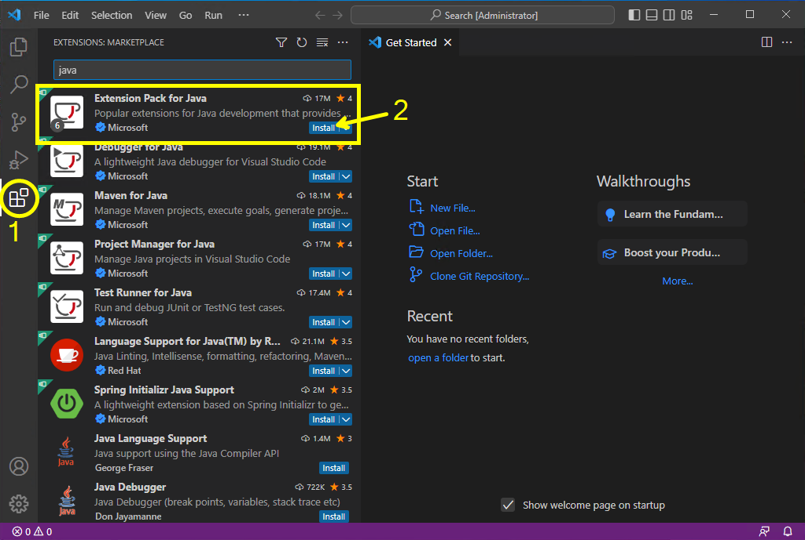

# Preparação do ambiente de trabalho no seu computador

Como no Inteli o Windows é o sistema operacional mais comumente utilizado, as instruções deste documente são específicas para computadores com este sistema. A instalação destas ferramentas em computadores com Linux ou MacOS é possível, mas provavelmente será necessário buscar procedimentos específicos para estes sistemas operacionais.

## Instalação do kit de desenvolvimento Java para as tarefas de programação

As tarefas de programação deste módulo 5 utilizarão o kit de desenvolvimento proposto pelo [LIFT-CS (*Laboratory for Innovation for the Future of Teaching Computer Science*)](https://lift.cs.princeton.edu) da Universidade de Princeton. Este pacote inclui o JDK 11, o Git e a IDE IntelliJ. Comece pela instalação deste pacote (mesmo que você pretenda utilizar outra IDE no desenvolvimento do projeto), pois o JDK 11 e o Git serão necessários.

Procedimento:

1. Acesse https://lift.cs.princeton.edu/java/windows/
2. Baixe o instalador indicado.
3. Faça a instalação do kit.
4. Siga o procedimento descrito na página para executar um primeiro programa no ambiente.

Este ambiente de desenvolvimento já vem configurado para facilitar o desenvolvimento os programas solicitados nas tarefas de programação dos nossos autoestudos.

## Instalação do Visual Studio Code

Embora o kit de desenvolvimento mencionado no item anterior seja o mais indicado para as tarefas de programação do nosso curso, para o desenvolvimento do projeto sugerimos utilizar o Visual Studio Code devido à sua facilidade de integração com o Git e devido ao grande número de extensões disponíveis (em particular, as extensões relacionadas ao formato Markdown).

Procedimento:

1. Acesse https://code.visualstudio.com/
2. Baixe o instalador indicado.
3. Faça a instalação do programa.
4. Execute o Visual studio Code.
   

   

## Instalação das extensões do Visual Studio Code para o desenvolvimento Java

Faça a instalação das extensões do Visual Studio Code para o desenvolvimento de aplicações na plataforma Java.

Procedimento:

1. Execute o Visual Studio Code.
2. Acesse a área das extensões e instale o *Extension Pack for Java*.

3. Para testar o ambiente de desenvolvimento, crie um novo projeto Java.

4. Para este primeiro teste, seleciona a opção *No build tools*.

5. Crie e selecione a pasta para o projeto.

6. Defina o nome do projeto.

7. Execute o programa-exemplo e verifique se a execução é bem-sucedida.

## Instalação das extensões do Visual Studio Code para a elaboração da documentação

A documentação do projeto utiliza o formato Markdown. Para tornar mais conveniente a edição de arquivos neste formato, vamos instalar no Visual Studio Code algumas extensões específicas para Markdown.

## Instalação das extensões do Visual Studio Code e das ferramentas para a elaboração do artigo

## Instalação das bibliotecas GDAL (para acessar formatos padronizados de dados geoespaciais)

