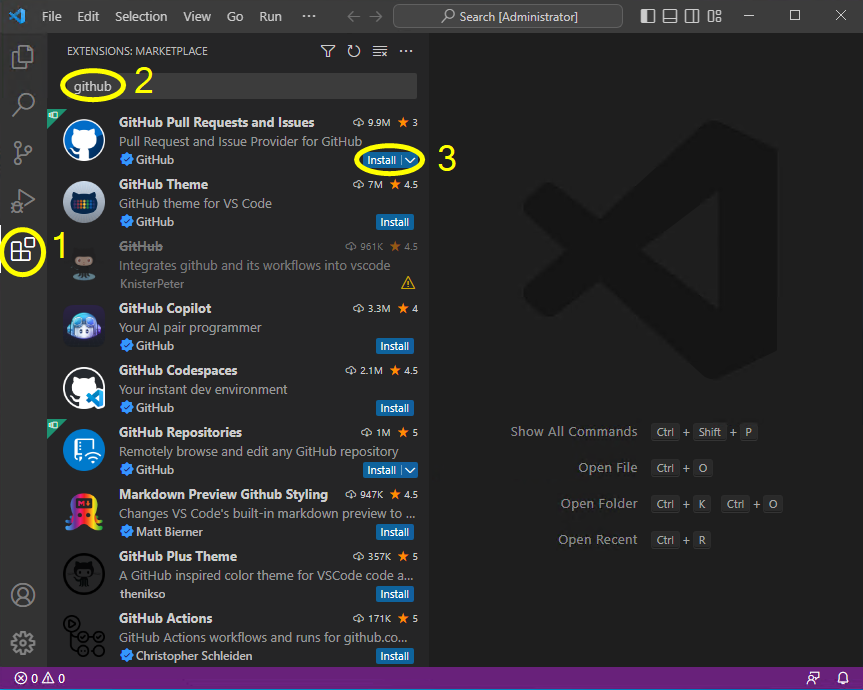

<p align="center">
<a href= "https://www.inteli.edu.br/"></a>
</p>

# Preparação do ambiente de trabalho no seu computador

Como no Inteli o Windows é o sistema operacional mais comumente utilizado, as instruções deste documente são específicas para computadores com este sistema. A instalação destas ferramentas em computadores com Linux ou MacOS é possível, mas provavelmente será necessário buscar procedimentos específicos para estes sistemas operacionais.

## Instalação do kit de desenvolvimento Java para as tarefas de programação

As tarefas de programação deste módulo 5 utilizarão o kit de desenvolvimento proposto pelo [LIFT-CS (*Laboratory for Innovation for the Future of Teaching Computer Science*)](https://lift.cs.princeton.edu) da Universidade de Princeton. Este pacote inclui o JDK 11, o Git e a IDE IntelliJ. Comece pela instalação deste pacote (mesmo que você pretenda utilizar outra IDE no desenvolvimento do projeto), pois o JDK 11 e o Git serão necessários.

Procedimento:

1. Acesse https://lift.cs.princeton.edu/java/windows/
2. Baixe o instalador indicado.
3. Faça a instalação do kit.
4. Siga o procedimento descrito na página para executar um primeiro programa no ambiente.


Este ambiente de desenvolvimento já vem configurado para facilitar o desenvolvimento os programas solicitados nas tarefas de programação dos nossos autoestudos.


## Instalação do Visual Studio Code

Embora o kit de desenvolvimento mencionado no item anterior seja o mais indicado para as tarefas de programação do nosso curso, para o desenvolvimento do projeto sugerimos utilizar o Visual Studio Code devido à sua facilidade de integração com o Git e devido ao grande número de extensões disponíveis (em particular, as extensões relacionadas ao formato Markdown).

Procedimento:

1. Acesse https://code.visualstudio.com/
2. Baixe o instalador indicado.
3. Faça a instalação do programa.
4. Execute o Visual studio Code.
   

   

## Configuração do Git

Se esta é a primeira vez que você utiliza o Git no seu computador, execute o procedimento a seguir para configurar o usuário e o email.

Procedimento:

1. No Visual Studio Code, abra um terminal.


2. Execute os comandos para configurar o seu nome e o seu email.


## Instalação da extensão *GitHub Pull Requests and Issues*

1. Execute o Visual Studio Code.
2. Acesse a área das extensões e instale a extensão *GitHub Pull Requests and Issues*.



## Instalação das extensões do Visual Studio Code para o desenvolvimento Java

Faça a instalação das extensões do Visual Studio Code para o desenvolvimento de aplicações na plataforma Java.

Procedimento:

1. Execute o Visual Studio Code.
2. Acesse a área das extensões e instale o *Extension Pack for Java*.


3. Para testar o ambiente de desenvolvimento, crie um novo projeto Java.


4. Para este primeiro teste, seleciona a opção *No build tools*.


5. Crie e selecione a pasta para o projeto.


6. Defina o nome do projeto.


7. Execute o programa-exemplo e verifique se a execução é bem-sucedida.


## Instalação das extensões do Visual Studio Code para a elaboração da documentação

A documentação do projeto utiliza o formato Markdown. Para tornar mais conveniente a edição de arquivos neste formato, vamos instalar no Visual Studio Code algumas extensões específicas para Markdown.

Procedimento:

1. Execute o Visual Studio Code.

2. Acesse a área das extensões e instale o *Markdown All in One*.


## Instalação das extensões do Visual Studio Code e das ferramentas para a elaboração do artigo

Neste módulo cada grupo deverá redigir um texto descrevendo os resultados do projeto no formato de um artigo científico. O conteúdo deste artigo será editado no formato Markdown, mas a geração do artigo em um formato próximo ao solicitado pelas publicações científicas será realizado utilizando as ferramentas LaTeX e pandoc.

Procedimento:

1. Acesse https://pandoc.org/installing.html e, a seguir, baixe e instale a ferramenta **pandoc**.

2. Acesse https://miktex.org/download e, a seguir, baixe e instale o sistema básico TeX/LaTeX.

3. Execute o Visual Studio code e, a seguir, acesse a área das extensões e instale o *vscode-pandoc* (instale a que tem como autor o *DougFinke*).

4. Ainda no Visual Studio Code, instale a extensão *vscode-pdf* (instale a que tem como autor o *tomoki1207*).

## Instalação das bibliotecas GDAL (para acessar formatos padronizados de dados geoespaciais)

1. Acesse https://build2.gisinternals.com/sdk/downloads/release-1916-x64-gdal-3-5-0-mapserver-7-6-4/gdal-305-1916-x64-core.msi. Após o término do download, execute a instalação (selecione a instalação completa).

2. Acesse https://build2.gisinternals.com/sdk/downloads/release-1916-x64-gdal-3-5-0-mapserver-7-6-4/gdal-305-1916-x64-filegdb.msi. Após o término do download, execute a instalação (selecione a instalação completa).

3. Crie variáveis de ambiente com os seguintes valores:


| Variável | Valor |
|----------|-------|
| GDAL_DATA | C:\Program Files\GDAL\gdal-data |
| GDAL_DRIVER_PATH | C:\Program Files\GDAL\gdalplugins |
| PROJ_LIB | C:\Program Files\GDAL\projlib |

4. Adicione o seguinte caminho ao `PATH`:

```
    C:\Program Files\GDAL
```

1. Vá até a pasta `C:\Program Files\GDAL\gdalplugins\` e mova para outra pasta (por exemplo, para `C:\Temp`) o arquivo `ogr_MSSQLSpatial.dll`.

## Próximos passos

Após a instalação de todos os itens deste documento, vá para a página com os [procedimentos de validação do ambiente](validate.md).